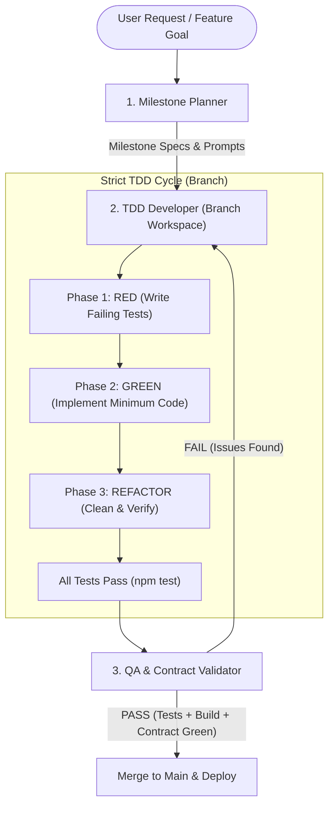

# Dynamic TDD Multi-Agent Workflow

This workflow orchestrates agile, branch-isolated development driven by Test-Driven Development (TDD).

---

## The 3-Agent Lifecycle

### 1. Milestone Planner (`milestone-planner`)
- Breaks goals down into atomic, sequential milestones.
- Formulates acceptance criteria and test expectations before any code is written.
- Generates targeted prompts for branch builder agents.

### 2. TDD Developer (`tdd-developer`)
- Spawns in an isolated git branch / workspace.
- **Red**: Writes tests in `src/**/__tests__/*.test.{js,jsx}` covering happy paths, edge cases, and guardrails.
- **Green**: Implements feature logic until `npm test` passes 100%.
- **Refactor**: Cleans up duplication, verifies styling tokens, and ensures zero build regressions.

### 3. QA & Contract Validator (`qa-validator`)
- Executes the full test suite (`npm test`) and build verification (`npm run build`).
- Audits contract adherence and logs achievements in `.claude/progress.md`.
- Approves merge to `main`.
