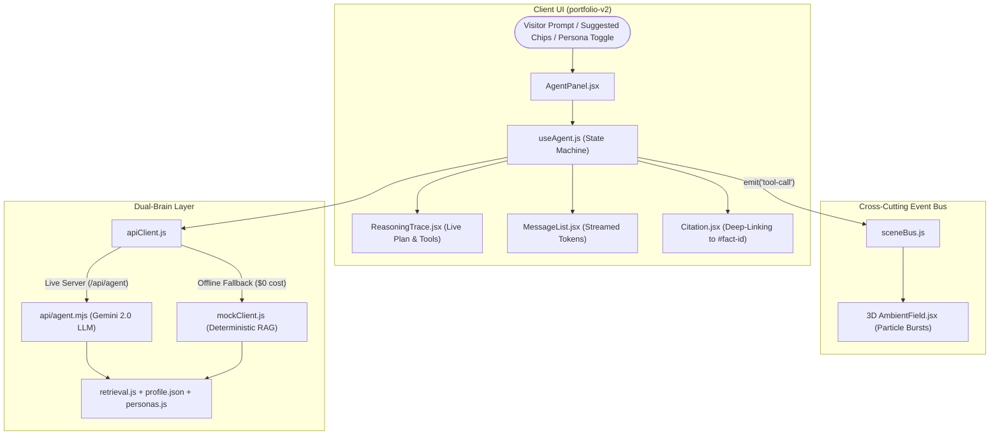

# Siddhartha Arora — AI-Agent Concierge Portfolio

[](https://siddharthaaa21.github.io/PorTfolio-React/)
[](LICENSE)
[](https://react.dev/)
[](https://threejs.org/)
[](https://vitest.dev/)

An **interactive AI-agent concierge** personal portfolio: a first-person agent answers questions about Siddhartha over his résumé data, displaying a **visible reasoning trace** (plan → tool calls → grounded response), accompanied by an **ambient Three.js 3D background** that dynamically pulses when agent tools fire.

Built with **React 18**, **Vite**, **React Three Fiber / Drei**, **Framer Motion**, and **Vitest**.

---

## ✨ Key Highlights

* **🤖 First-Person AI Concierge**: Speaks as Siddhartha (*"I built...", "I led..."*) with live streaming responses and anti-prompt injection guardrails.
* **🧠 Dual-Brain Architecture**: Seamlessly streams from Google Gemini 2.0 via serverless NDJSON, with automatic fallback to an offline RAG-lite brain ($0 cost, no API keys needed for preview).
* **🌌 Reactive 3D Ambient Scene**: Three.js particle starfield and distorted icosahedron that pulse in response to agent tool-calls via an event bus (`sceneBus`). Code-split for fast initial page load (95 kB gzipped).
* **🎭 Multi-Persona Switching**:
  * **Recruiter**: Fit, outcomes, metrics, and contract availability.
  * **Engineer**: System architecture, delta-sync consistency, and tech stack trade-offs.
  * **Founder**: ROI, velocity, and delivery speed in 2-week Agile sprints.
* **🔗 Provenance & Citation Deep-Linking**: Clickable citation tags (e.g. `[Infosys · resume]`) that smooth-scroll and pulse-highlight the referenced résumé bullet.
* **🧪 Test-Driven Development (TDD)**: Verified with automated unit tests for keyword scoring, synonym hints, prompt-injection defenses, and citation interactions.

---

## 🏛️ System Architecture



---

## 🚀 Quick Start

### 1. Run Offline (Zero Configuration, $0)
Clone the repository and start the development server:

```bash
# Clone repository
git clone https://github.com/Siddharthaaa21/PorTfolio-React.git
cd PorTfolio-React

# Install dependencies and start
npm install --prefix portfolio-v2
npm run dev
```
Open **[http://localhost:5173](http://localhost:5173)**. The agent runs automatically on the offline RAG brain.

---

### 2. Run with Live Gemini LLM (Optional)
To connect the agent to a live LLM:

1. Obtain a free API key from [Google AI Studio](https://aistudio.google.com/apikey).
2. Create `portfolio-v2/.env.local`:
   ```bash
   cp portfolio-v2/.env.example portfolio-v2/.env.local
   # Add your GEMINI_API_KEY inside .env.local
   ```
3. Start the local serverless handler and dev server:
   ```bash
   # Terminal 1: Starts local agent API host on :8787
   npm run api

   # Terminal 2: Starts frontend dev server (proxies /api to :8787)
   npm run dev
   ```

---

## 🧪 Testing & Verification

Run unit and integration test suites using Vitest:

```bash
# Run test suite
npm test

# Run tests in watch mode
npm run test:watch --prefix portfolio-v2
```

---

## 📁 Repository Structure

```
.
├── portfolio-v2/                 # Modern React 18 + Vite application
│   ├── src/
│   │   ├── scene/                # Ambient Three.js starfield + 3D icon
│   │   ├── agent/                # AgentPanel, ReasoningTrace, Citations, RAG retrieval
│   │   │   └── __tests__/        # Automated Vitest unit test suites
│   │   ├── content/              # profile.json (résumé data) & personas.js
│   │   ├── sections/             # Hero, Experience, Projects, Skills, Contact
│   │   ├── ui/                   # Design token primitives (Button, Chip, Panel)
│   │   └── styles/               # tokens.css & global.css
│   ├── api/                      # Serverless agent handler (api/agent.mjs)
│   └── vite.config.js            # Vite & Vitest configuration
├── .claude/                      # Multi-agent system specifications & workflow
├── .github/workflows/deploy.yml  # Automated GitHub Pages CI/CD workflow
├── LICENSE                       # MIT License
└── package.json                  # Root proxy scripts
```

---

## 🚢 Deployment

The portfolio is automatically built and deployed to **GitHub Pages** via GitHub Actions on every push to `main`:
* Deployment Workflow: [`.github/workflows/deploy.yml`](.github/workflows/deploy.yml)
* Live Site: [https://siddharthaaa21.github.io/PorTfolio-React/](https://siddharthaaa21.github.io/PorTfolio-React/)

---

## 📄 License

This project is licensed under the [MIT License](LICENSE).
